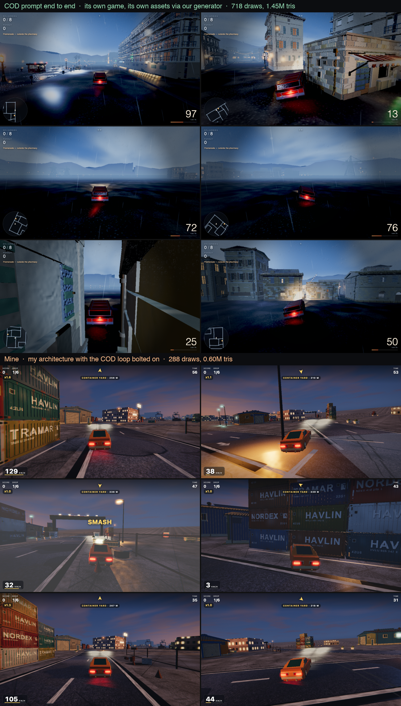

# Build a game with your own agent

Point your coding agent at this repository and describe a game. It will generate the 3D assets,
verify them, build the game, and keep going until a harsh critic stops beating it.

No account, no API key, no GPU, nothing to pay for. Your agent does the work.

```
Read BUILD.md in this repo and build me a game about <anything>.
```

That's the whole interface. Works with Claude Code, Codex, Cursor, or anything that can read
files and run commands.

**[The method →](BUILD.md)**



*Two games built this way, captured in motion by the harness in this repo. Every building,
vehicle and prop in both was generated from a reference image. Nothing is hand-modelled.*

---

## What it actually does

Most agents can write Three.js. What they don't do, unless told, is **look at what they made
and try again** — and that gap is most of why AI-built games look AI-built.

This repo is two loops that close it.

**A loop around each asset.** Start from a reference image rather than a sentence. Generate
three genuinely different attempts. Render each from four sides. Look, and pick.

We measured that: one arm got a single attempt, the other got three plus verification and a
choice. Same model, same references. The second won on essentially every object, and the
difference was entirely the loop. It caught an inverted rotation sign that flung a car's
windscreen into space, and a water tank built 20% too tall because the reference photo
foreshortened its base. Neither is a syntax error. Neither survives being looked at.

**A loop around the game**, which is [Claude-of-Duty](https://github.com/mshumer/Claude-of-Duty)'s
method: fan out sub-agents, and have a genuinely harsh critic compare the result against a real
reference, blind, and send it back if it loses.

The two compose because they solve different halves. COD's loop drives the game and its art
direction. This one makes the objects standing in it hold up.

---

## What's in here

| | |
|---|---|
| **[BUILD.md](BUILD.md)** | The method. The only file your agent strictly needs. |
| **[gen/](gen/)** | Reference images, then geometry, then verification. |
| **[harness/verify.mjs](harness/verify.mjs)** | Renders every asset from four sides and measures it. Catches what review misses. |
| **[harness/playtest.mjs](harness/playtest.mjs)** | Plays the finished game and shoots a filmstrip **in motion**. |
| **[harness/selftest/](harness/selftest/)** | Proves the verifier fires, against deliberately broken fixtures. |
| **[harness/assetlib.js](harness/assetlib.js)** | The loader. Copy it, don't rewrite it. The comment at the top says why. |
| **[docs/traps.md](docs/traps.md)** | Bugs in this domain that produce wrong output *silently*. Read first. |

```bash
git clone https://github.com/404-Repo/404-game-recipe
cd 404-game-recipe
npm install
node harness/selftest/run.mjs      # proves the verifier actually catches things
```


*What `harness/verify.mjs` writes: every asset from four sides under identical light. The check
that earns its place is the fourth column — an object modelled only from the angle its
reference showed is a featureless box from behind, and every screenshot hides it because every
screenshot is taken from the good side.*

---

## Three things worth knowing before you start

**Pick by eye, never by score.** A scoring heuristic once chose a broken planter at 265,265
triangles over a correct one at 3,880. Numbers tell you what is broken; they cannot tell you
what is good.

**Place things by hand.** We built two games from an identical asset pack, one with authored
coordinates and one with a placement rule tuned for density and spacing. The authored one was
dramatically better. Rules produce arrangements that are plausible and dead, because nothing
has a reason to be anywhere.

**Judge the game in motion, not parked.** We have watched a build whose parked screenshots were
beautiful and whose driving frames were a dark unreadable mess, passed every round by its own
critic because the critic was comparing stills. `harness/playtest.mjs` exists for this.

---

## Using the assets elsewhere

One module per asset, exporting a function of `THREE`:

```js
import { ASSET } from './harness/assetlib.js';
const car = await ASSET('./assets/hero_coupe.js', { height: 1.44 });
scene.add(car);
```

Plain Three.js with no dependency on anything else here. Full spec in
[docs/asset-contract.md](docs/asset-contract.md).

---

## Credits

[Claude-of-Duty](https://github.com/mshumer/Claude-of-Duty) by Matt Shumer, for the game-side
method and the critic loop this borrows. Worth being precise about what it is, because it is
widely misread as a zero-shot prompt: it is an **orchestration** prompt, and the critic loop is
why its output beats a single pass.

Reference images in the example were made with [Atlas](https://atlas.design). Any image source
works; [docs/concept-images.md](docs/concept-images.md) covers what makes a good one.

Built by [404](https://404.xyz) out of a lot of failed attempts. Apache 2.0 — build things with it.
