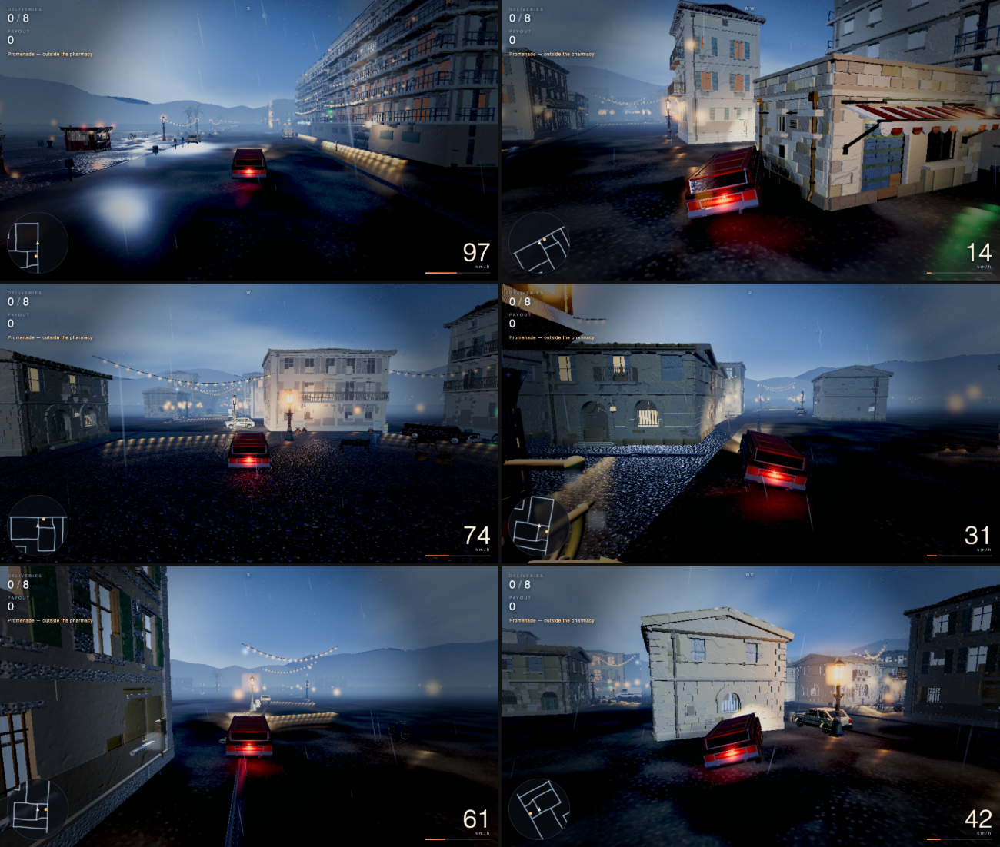
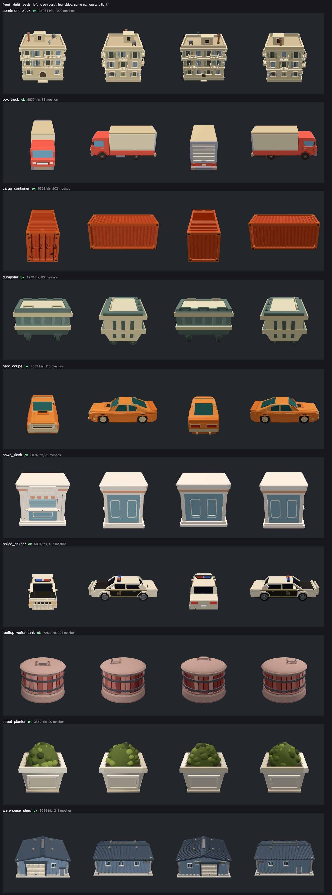

# 404 game recipe

Two things:

1. **[404.md](404.md)** — how to generate 3D assets: your agent writes the geometry, or the
   open model behind the live 404 competition runs on your own GPU.
2. **[GAME.md](GAME.md)** — how to build a game, using Claude-of-Duty's prompt plus the above.

The default path needs no account, no API key, no GPU, nothing to pay for. Your agent does the
work.

```
Read GAME.md in this repo and build me a game about <anything>.
```

That's the whole interface. It needs an agent that can read files, run shell commands and look
at images. It was built and tested with Claude Code.



*A game built this way, captured in motion by `harness/playtest.mjs` from this repo. It went from
an empty directory to this in about four hours unattended: 73 reference images, 194 candidate
meshes, 36 assets kept. Every building, vehicle and prop was generated from a reference image.
Nothing is hand-modelled and nothing is textured from a file.*

---

## 1. The assets

404 generates 3D as **code**: one JavaScript module per object returning a Three.js `Group`. No
mesh files, nothing to download.

The method is one reference image, three independent attempts at geometry, a render from four
sides, and a choice made by looking. Who writes the geometry is up to you: your agent, or the
open model behind the leader of the live
[404 generation competition](https://github.com/404-Repo/404-active-competition), one-click
deployed on your own GPU. [404.md](404.md) covers both.

We measured it on ten objects. One arm got a single attempt, the other got three plus
verification and a choice. Same model, same references. The second won on essentially every
object, and the difference was entirely the loop. It caught an inverted rotation sign that flung
a car's windscreen into space, and a water tank built 20% too tall because the reference photo
foreshortened its base. Neither is a syntax error. Neither survives being looked at.

**[→ 404.md](404.md)**



*What `harness/verify.mjs` writes. The check that earns its place is the fourth column: an object
modelled only from the angle its reference showed is a featureless box from behind, and every
screenshot hides it because every screenshot is taken from the good side.*

## 2. The game

[Claude-of-Duty](https://github.com/mshumer/Claude-of-Duty) by Matt Shumer, changed only where it
names a genre. Fan out sub-agents, loop, and let a harsh critic compare against a real reference,
blind, and send the work back if it loses.

Your agent decides its own architecture. That is the point of the prompt and this repo does not
second-guess it. The only substitution we make is that every object comes from 404 rather than
from primitives it invents.

**[→ GAME.md](GAME.md)**

---

## Start

```bash
git clone https://github.com/404-Repo/404-game-recipe
cd 404-game-recipe
npm install
node harness/selftest/run.mjs      # proves the verifier actually catches things
```

| | |
|---|---|
| **[404.md](404.md)** | Generating assets with your own agent. |
| **[GAME.md](GAME.md)** | Building a game with COD's prompt plus 404. |
| **[docs/concept-images.md](docs/concept-images.md)** | Reference images: what makes a good one, and where to get them. |
| **[harness/wrap.mjs](harness/wrap.mjs)** | Rescales open-model output into this repo's contract. |
| **[harness/verify.mjs](harness/verify.mjs)** | Renders every asset from four sides. Catches what review misses. |
| **[harness/playtest.mjs](harness/playtest.mjs)** | Plays the finished game and captures it **in motion**. |
| **[harness/selftest/](harness/selftest/)** | Proves the verifier fires, against deliberately broken fixtures. |
| **[harness/assetlib.js](harness/assetlib.js)** | The loader. Copy it, don't rewrite it. |
| **[docs/traps.md](docs/traps.md)** | Bugs in this domain that produce wrong output *silently*. Read first. |

---

## Credits

[Claude-of-Duty](https://github.com/mshumer/Claude-of-Duty) by Matt Shumer, for the game side.
Worth being precise, because it is widely misread as a zero-shot prompt: it is an
**orchestration** prompt, and the critic loop is why its output beats a single pass.

Any image source works for references; [docs/concept-images.md](docs/concept-images.md) covers
what makes a good one.

Built by [404](https://404.xyz). Apache 2.0 — build things with it.
