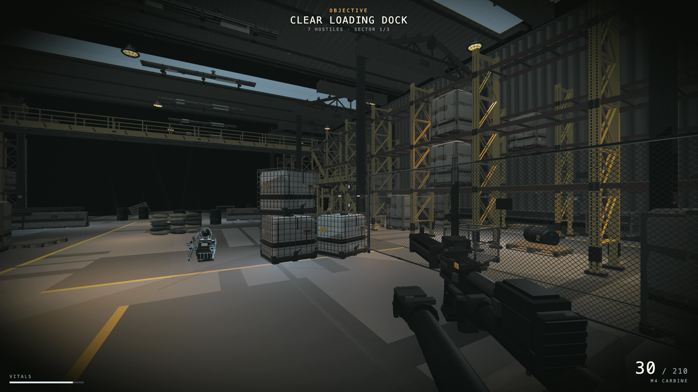
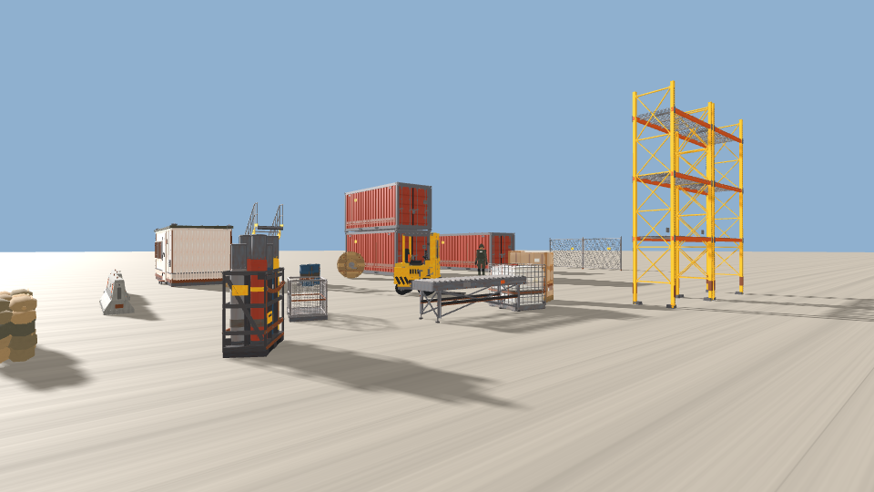
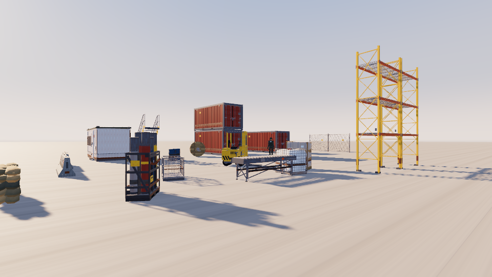

# 404 game recipe

### 3D assets as code, for agents that build games.

Agents can build games now. What they cannot do is furnish them. Ask one for a city and you get
a city of boxes, because inventing geometry out of primitives is the only 3D it has. Asset
quality is the ceiling on every agent-built game we have seen, including our own.

404 generates 3D as **code**: one JavaScript module per object that returns a Three.js `Group`.
No mesh files, no textures, nothing to download. An agent can read an asset, change it and place
it, which is not true of anything it fetches as a binary.

404 also runs a continuous open competition to push image-to-code quality, and the winning
weights are open. This repository is the whole method, free: how to make assets this way, and how
to build a game out of them.



*A game built this way. Every object in that frame was generated as code: the racking, the
pallets, the totes, the catwalk and its lamps, the forklift, the soldier, the carbine in your
hands. 33 reference images, 99 candidate modules written, 33 kept. Nothing is hand-modelled,
nothing is downloaded, and there is not one image file in the finished game.*

**[Play it](https://404-repo.github.io/warehouse-fps/)**. It is in this repo too, under
[`example/warehouse-fps`](example/), at 708 KB, and it runs from a served folder with no build step.

```
Read GAME.md in this repo and build me a game about <anything>.
```

That's the whole interface. It needs an agent that can read files, run shell commands and look
at images, and a machine with Node 20 or newer. A GPU is only involved if you choose the
open-model path, and it is a rented one. It was built and tested with Claude Code.

---

## Why code instead of meshes

- **An agent can edit it.** A module is source. It can change a proportion, a colour or a part
  breakdown by editing lines, which it cannot do to a binary mesh.
- **It diffs.** Assets live in git next to the game, and a change to one is reviewable.
- **There is no texture pipeline.** No UVs, no image files, no loaders, no missing-texture pink.
- **It is small.** A prop is a few kilobytes of source, so a whole set costs less than one
  photograph.
- **It is inspectable.** When an asset comes out wrong you can read why, which is the difference
  between fixing a generator and rerolling it.

## What is in here

| | |
|---|---|
| [GAME.md](GAME.md) | the prompt, and the handful of things that decide whether the loop works |
| [404.md](404.md) | how to make the 3D, with your agent or with the open model |
| [docs/gates.md](docs/gates.md) | writing a gate for your own game, since ours drives forward and yours may not |
| [docs/claims.md](docs/claims.md) | the floor build, and turning reference frames into claims that can fail a round |
| [docs/case-drive.md](docs/case-drive.md) | one build start to finish: what each round changed, what it scored, what it cost |
| [docs/traps.md](docs/traps.md) | bugs in this domain that produce wrong output silently |
| `harness/` | verify assets, play the game, check what you shipped, prove the live URL works |

## 1. The assets

The method is one reference image, three independent attempts at geometry, a render from four
sides, and a choice made by looking. Who writes the geometry is up to you: your agent, or the
open model behind the leader of the live
[404 generation competition](https://github.com/404-Repo/404-active-competition), one-click
deployed on your own GPU. [404.md](404.md) covers both. The default path needs no account, no
API key, no GPU and nothing to pay for.

We measured the loop on ten objects. One arm got a single attempt, the other got three plus
verification and a choice. Same model, same references. The second won on essentially every
object, and the difference was entirely the loop. It caught an inverted rotation sign that flung
a car's windscreen into space, and a water tank built 20% too tall because the reference photo
foreshortened its base. Neither is a syntax error. Neither survives being looked at.

**[→ 404.md](404.md)**


*What `harness/verify.mjs` writes. The check that earns its place is the third column: an object
modelled only from the angle its reference showed is a featureless box from behind, and every
screenshot hides it because every screenshot is taken from the good side. The fifth column is not
measured and is there to be looked at, because a recess or an opening reads as a flat rectangle
from dead ahead and only shows itself at an angle.*

## 2. The game

[Claude-of-Duty](https://github.com/mshumer/Claude-of-Duty) by Matt Shumer, changed only where it
names a genre. Fan out sub-agents, loop, and let a harsh critic compare against a real reference,
blind, and send the work back if it loses.

Your agent decides its own architecture. That is the point of the prompt and this repo does not
second-guess it. The only substitution we make is that every object comes from 404 rather than
from primitives it invents.

**[→ GAME.md](GAME.md)**

## 3. The lighting

Assets are only half of what a frame is made of, and the repo used to stop at the assets. A reader
writing lighting from scratch writes one `DirectionalLight` and one `AmbientLight`, and that is a
lit box: every surface in frame is the same colour temperature, so the picture has no depth in it
and no amount of asset quality puts any back.

`harness/rig.js` is one rig that works, offered so nobody starts from a grey scene. It is a
recommendation and not a rule, and the architecture of your game stays yours. Copy it next to
`assetlib.js` the way you copy that one. It has no npm dependency, no image file and no static
import, and it is two lines:

```js
const rig = createRig(THREE, renderer, scene, { hour: 16.5, azimuth: 250 });
rig.render(camera, dt);        // once a frame, instead of renderer.render(scene, camera)
```



*One `DirectionalLight`, one `AmbientLight`, no tone mapping, no fog. The key was given a 2048
shadow map and both its intensities were scaled until its sunlit ground matched the rig's, because
a baseline with no shadows and half the brightness is a straw man. Twenty three placements of
seventeen generated assets, a ground plane, eye height.*



*The same frame, same assets, same camera, same sun direction, lit by `harness/rig.js` at 16:30.*

Look at the shaded sides and the distance rather than at the brightness, which is matched on
purpose. Measured on two patches of the same road, one in sun and one in the shadow of the same
object: shade is **55 units of blue minus red cooler than sun** under the rig and **4 units
warmer** under the pair of lights, which is the lit box. The 98th percentile of the frame is 221
against 215, and **1.3 percent of the plain frame is clipped to white** against none of the rig's,
because there is no tone curve on it.

Two honest notes on that pair. The difference is real and it is not dramatic, because a shadow
casting key at a matched exposure is already most of the way there; what the rig adds on top is the
colour of the shade, a sky that agrees with the light, and haze with distance in it. And the rig
costs three times the draw calls of the two lights in this scene, 549 against 183, because a second
cascade and a composer pass redraw the world. The phone tier drops the second cascade and the
composer for that reason. Nobody has measured either on a real GPU. The rig's own header comment
carries the full table, the settings and what it does not do, which includes ambient occlusion.

---

## Start

```bash
git clone https://github.com/404-Repo/404-game-recipe
cd 404-game-recipe
npm install
npm run selftest      # proves the verifier actually catches things
```

Then point your agent at [GAME.md](GAME.md), or at [404.md](404.md) if you only want assets.

| | |
|---|---|
| **[404.md](404.md)** | Generating assets, with your agent or the open model. |
| **[GAME.md](GAME.md)** | Building a game with COD's prompt plus 404. |
| **[docs/asset-contract.md](docs/asset-contract.md)** | What every asset module must be. |
| **[docs/concept-images.md](docs/concept-images.md)** | Reference images: what makes a good one, and where to get them. |
| **[docs/traps.md](docs/traps.md)** | Bugs in this domain that produce wrong output *silently*. Read first. |
| **[docs/verify-loop.md](docs/verify-loop.md)** | What the verifier and the playtest actually check, and why. |
| **[harness/verify.mjs](harness/verify.mjs)** | Renders every asset from four sides. Catches what review misses. |
| **[harness/wrap.mjs](harness/wrap.mjs)** | Rescales open-model output into this repo's contract. |
| **[harness/playtest.mjs](harness/playtest.mjs)** | Plays the finished game and captures it **in motion**. |
| **[harness/selftest/](harness/selftest/)** | Proves the verifier fires, against deliberately broken fixtures. |
| **[harness/rig.js](harness/rig.js)** | A render rig you can drop into a game in two lines. Two colour temperatures, aerial perspective, a sky that agrees with the light. |
| **[harness/assetlib.js](harness/assetlib.js)** | The loader. Copy it, don't rewrite it. |

Every tool takes the directory you are working in as its argument, so nothing here assumes a
layout. The directory can be relative or absolute, and it does not have to be inside this repo:

```bash
node harness/verify.mjs   my_assets/
node harness/verify.mjs   ~/somewhere/else/assets
node harness/wrap.mjs     pod_out/fuel_barrel.js 0.88 -o my_assets/fuel_barrel.js
node harness/playtest.mjs my_game/
node harness/playtest.mjs /abs/path/to/my_game
```

Both tools serve your directory under its own prefix, so a path inside it resolves normally and
a path that climbs above it, such as a game's `../harness/assetlib.js`, still reaches this repo.
`harness/selftest/run.mjs` checks this, because the version that only served the repo root
failed every asset in an outside directory with a message that read like a broken asset.

---

## Credits

[Claude-of-Duty](https://github.com/mshumer/Claude-of-Duty) by Matt Shumer, for the game side.
Worth being precise, because it is widely misread as a zero-shot prompt: it is an
**orchestration** prompt, and the critic loop is why its output beats a single pass.

Any image source works for references; [docs/concept-images.md](docs/concept-images.md) covers
what makes a good one.

Built by [404](https://404.xyz). Apache 2.0, so build things with it.
